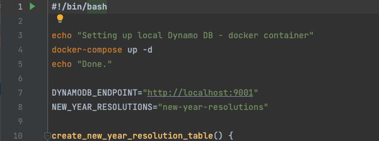
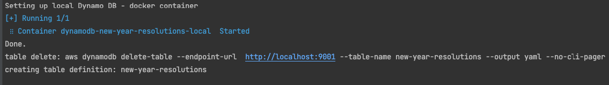
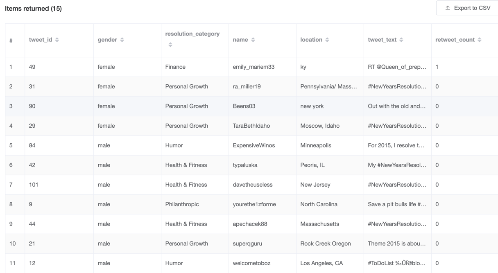
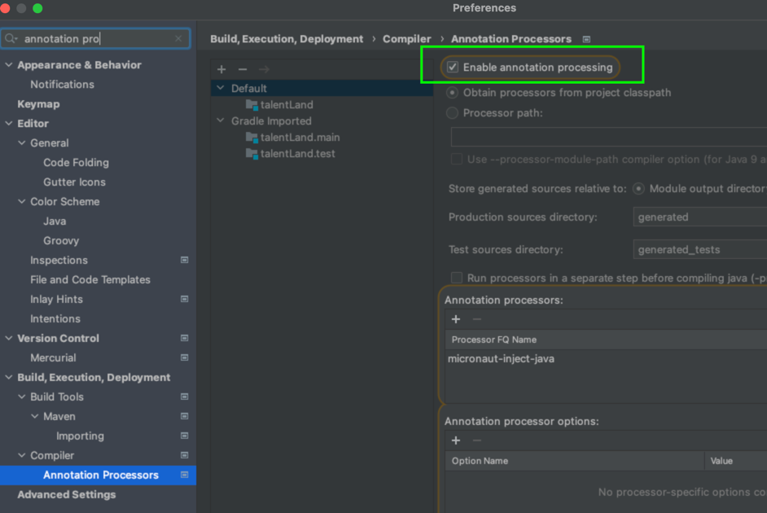
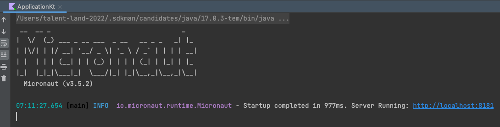
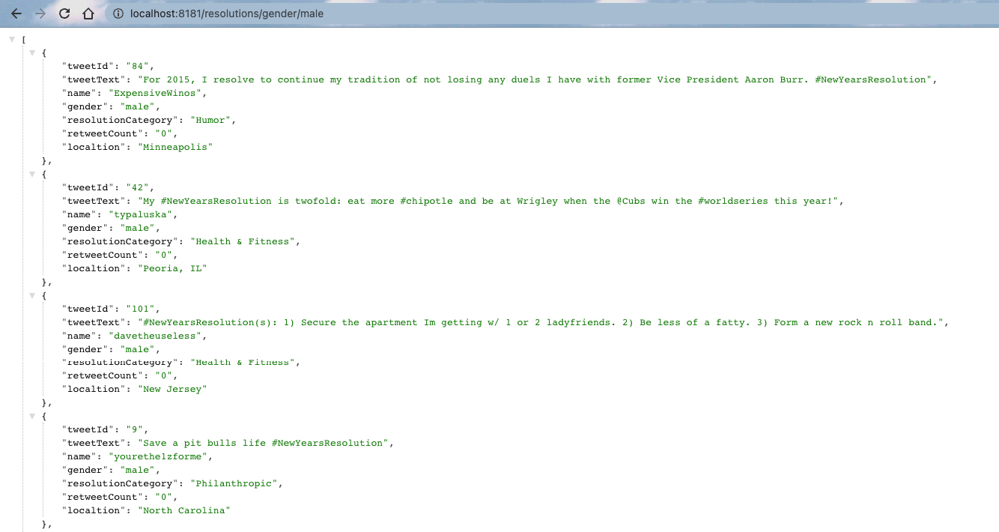

# Micronaut y programación reactiva #

---

## Objetivo ##

Al finalizar este taller, el participante habrá:

* Conocido un nuevo framework de aplicaciones
* Obtenido contexto sobre un paradigma de programación
* Usado nuevas herramientas
* Generado un poco de ammsiedad por las nuevas cosas que ahora sabe que no sabía :p

  

**¿Qué vamos a hacer hoy?**

En este workshop usaremos como base esta aplicación que recupera de una base de datos una lista de tweets
cuyo tema son los propósitos de año nuevo. La forma de consumir los tweets es a través de un servicio
REST. El proyecto, aunque cumple con el propósito de la aplicación,
está implementado de una manera no reactiva. El objetivo de este workshop es transformar esta
app en una aplicación reactiva utilizando el proyecto Reactor.

---

## **Software necesario para este workshop** ##
* JDK 16 o superior - Puede ser el [OpenJDK](https://openjdk.org/projects/jdk/17/) o [Adoption](https://adoptium.net/) de Eclipse Fundation
* [Micronaut](https://micronaut.io/download/) 3.5.X

En el caso de Micronaut y Java, recomiendo instalarlo usando [SDKMan](https://sdkman.io/),
ya que también agrega las variables de entorno necesarias para estas 2 dependencias

* [AWS CLI](https://docs.aws.amazon.com/cli/latest/userguide/getting-started-install.html) 2.7.X - Para conectarnos a la instancia local de DynamoDB
* [Siege](https://www.joedog.org/siege-manual/) 4.X.X - Para estresar a nuestro servicio
* [Docker Desktop](https://www.docker.com/products/docker-desktop/) 4.X.X
    * De ser posible, antes del workshop descargar la imagen para DynamoDB: `docker pull amazon/dynamodb-local:latest`
      esto nos ahorrará unos minutos

Asegurate de tener las variables de entorno:
* `$MICRONAUT_HOME`
* `$JAVA_HOME`

Ademas de agregar a la variable de entorno `$PATH` la ruta de los ejecutables de Java y Micronaut.

### Opcionales
* [Intellij IDEA](https://www.jetbrains.com/idea/download/) - Con la version community basta para este workshop.
* Se puede usar otra herramienta para medir el performance de aplicaciones web, como [Wrk](https://thechief.io/c/editorial/top-10-http-benchmarking-and-load-testing-tools/#Wrk)
  o [Apache HTTP server benchmarking tool](https://httpd.apache.org/docs/2.4/programs/ab.html)
* [Postman](https://www.postman.com/)

---

## Setup

#### Base de datos
Para la inicialización de la base de datos, asegúrate que Docker desktop esté corriendo, ya que
para la base de datos vamos a usar la imagen de DynamoDB.

* Para crear y cargar la tabla ejecuta el siguiente script: `setup-db.sh` que se encuentra dentro de la carpeta docker del proyecto. Lo puedes
  ejecutar desde línea de comandos: `/bin/bash [PROJECT_PATH]/talent-land-micronaut-reactive-programming/docker/setup-db.sh`
  o desde el IDE haciendo clic en el icono de Run:

Verás en el log de la consola una salida similar a la siguiente:

Puede que tarde un par de minutos mientras descarga la imagen de Docker, cree e inserte registros en la tabla.
Esta es la estructura de la tabla que se crea:

#### Intellij IDEA
Si decides utilizar Intellij, asegúrate de habilitar el procesamiento de anotaciones, como se muestra
en la siguiente imagen:

#### Ejecutar la aplicación
Lo puedes hacer con el botón de Play del IDE, yendo a la clase principal `Application.kt` y dar clic en el botón de Play
o desde línea de comandos, ubicándote en el directorio del proyecto y ejecutando `./gradlew run`.
Verás una salida en consola como la siguiente:

#### Request de ejemplo

Para validar que la aplicación y base de datos está configurada correctamente, puedes
hacer la siguiente petición usando la herramienta `curl` de línea de comandos, Postman o el navegador

`curl http://localhost:8181/resolutions/gender/male` para obtener una lista de propósitos de año nuevo por género

Si todo está ejecutándose correctamente, verás una salida como la siguiente:

---

## A ensuciarse las manos 

Como se menciona al inicio de este documento, el objetivo es transformar esta app en una app reactiva. Para eso 
tendrás que crear un Controller, Service y Repository nuevo utilizando las clases y operadores reactivos correspondientes

### Tipos principales

* Flux
* Mono

### Operadores reactivos
La siguiente es una lista de operadores reactivos con los que podemos re implementar la solución actual
y hacerla reactiva:

* range
* flatMap
* take
* onErrorReturn
* onErrorResume
* map
* filter
* buffer
* count
* just
* switchIfEmpty

Puedes ver la descripción y ejemplos de estos y más operadores en la el manual de referencia de
[Reactor](https://projectreactor.io/docs/core/release/reference/index.html#which-operator)

### Base de datos
Se está usando el driver `dynamodb-enhanced` de Amazon para conectarse a la base de datos, el cual soporta 
programación síncrona (usando el cliente `DynamoDbEnhancedClient`) asi como asíncrona usando `DynamoDbEnhancedAsyncClient`.
Esta última interfase nos servirá para conectarnos a DynamoDB de manera que la base de datos no sea algo que bloquee nuestro 
event loop. Puedes ver la documentación de referencia [aqui](https://sdk.amazonaws.com/java/api/latest/software/amazon/awssdk/enhanced/dynamodb/DynamoDbEnhancedAsyncClient.html)

#### Comandos  ####
A continuación una lista de comandos que te serán útiles a través de este workshop:

* Ejecutar la aplicación desde línea de comandos: `./gradlew run`.
* Benchmarking con **Siage**: `siege http://localhost:8181/resolutions/gender/male/contains/a -c 5 -r 1`
  * Donde `-c` es para indicar los usuarios concurrentes y
  * `-r` para indicar las repeticiones
* Para borrar la tabla de tweets: `aws dynamodb delete-table --endpoint-url  http://localhost:9001 --table-name new-year-resolutions --output yaml --no-cli-pager`

---

### Referencias

#### Micronaut 3.5.2 Documentation

- [User Guide](https://docs.micronaut.io/3.5.2/guide/index.html)
- [API Reference](https://docs.micronaut.io/3.5.2/api/index.html)
- [Configuration Reference](https://docs.micronaut.io/3.5.2/guide/configurationreference.html)
- [Micronaut Guides](https://guides.micronaut.io/index.html)
---

- [Shadow Gradle Plugin](https://plugins.gradle.org/plugin/com.github.johnrengelman.shadow)
#### Feature http-client documentation
- [Micronaut HTTP Client documentation](https://docs.micronaut.io/latest/guide/index.html#httpClient)